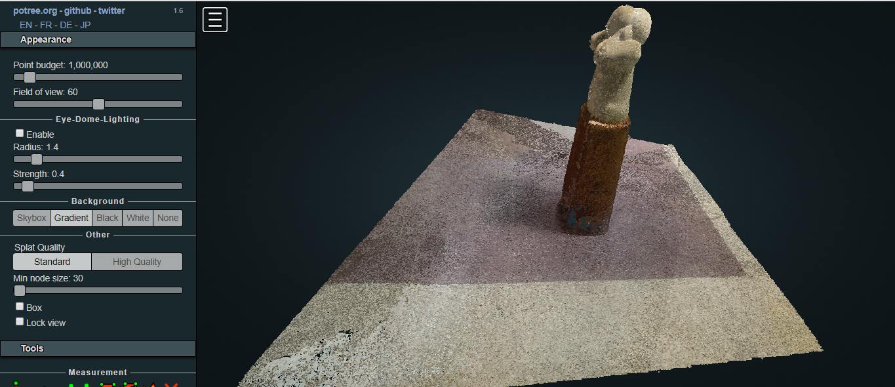
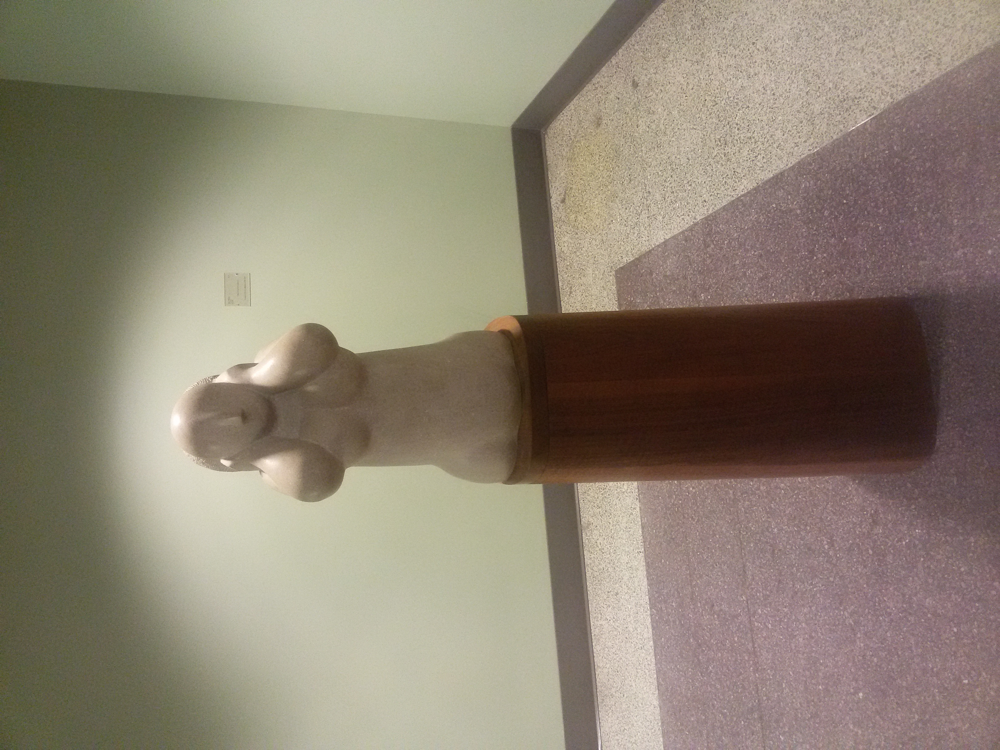
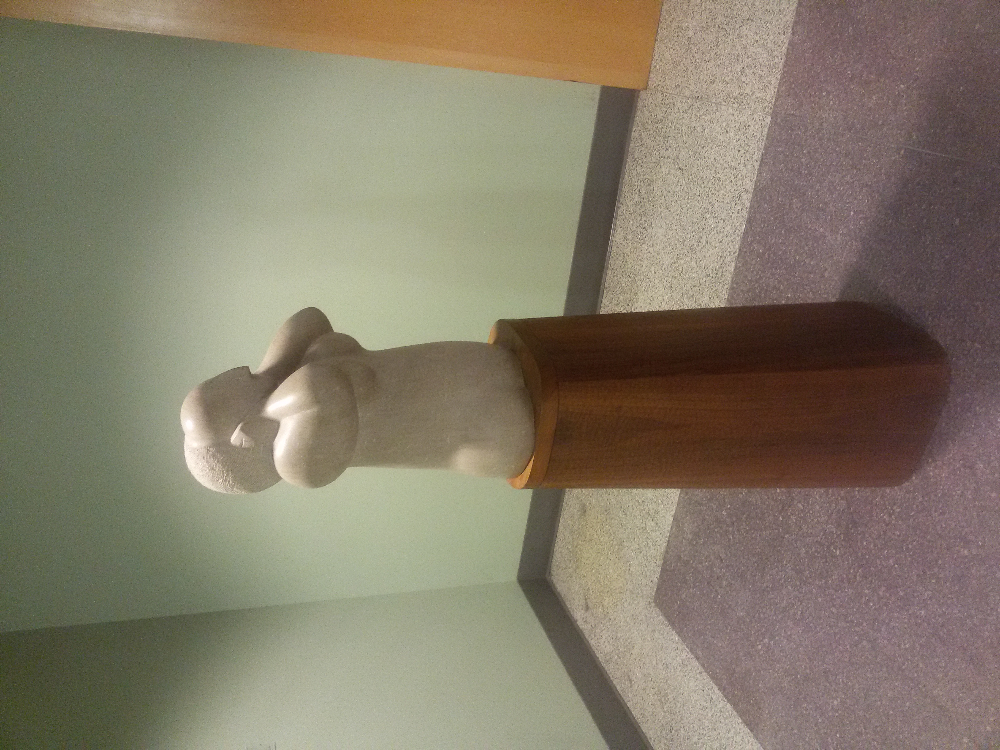
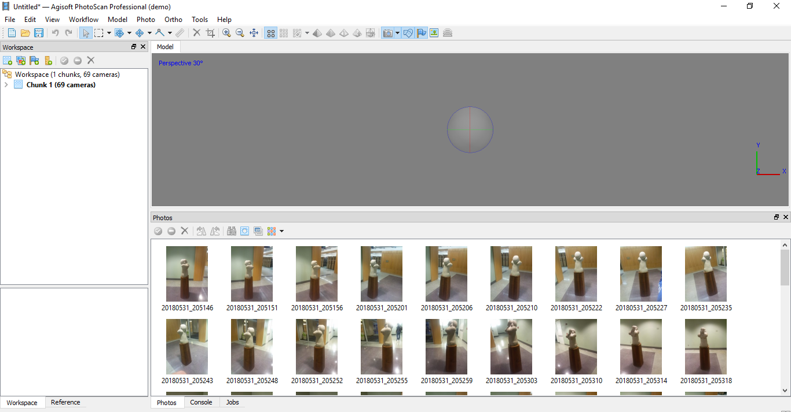
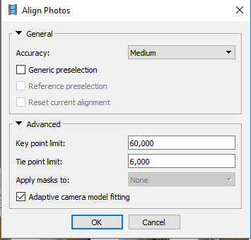
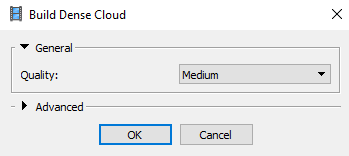
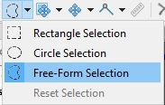

# Lab6-potree
##### By Majid Farahani
Project with the primary goal of adding SfM images into a potree viewer.

## Project summary

This is the 3d point cloud from a statue in the basement of valley library at Oregon State university.

At first we took 69 picture in different angles from the statue and add them to a software called Agisoft 
Photo scan. You can see two of them below.

After adding point from the workflow tap, use the align photos to align all
 photos. In this step I used medium option for the accuracy.
 
 
 
 
  
 Then used the densecloud to see the better point cloud.
 
  
   
At next step for editing the point cloud I used the Free-Form Selection to
 delete the extra points.
 
 
  
 Finally export the file in format of .las.
In next step, I download the Potree Conversion 1.6 release and download the zip file. Then place them in a folder that will solely be dedicated to this Potree page. next I Extract the files in this location.

